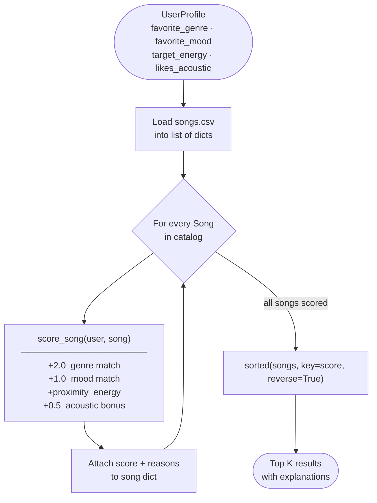

# 🎵 Music Recommender Simulation

## Project Summary

This project simulates how a basic content-based music recommendation system works.
Given a user's taste profile (preferred genre, mood, energy level, and acoustic preference),
the system scores every song in a small catalog and returns the top matches with plain-language
explanations of why each song was chosen.

The goal is to mirror — in simplified form — the kind of logic Spotify or YouTube use when
suggesting "you might also like" tracks, and to make that process transparent and explainable
rather than a black box.

---

## How The System Works

### 1. How Real Recommendation Systems Work

Major streaming platforms like Spotify and YouTube use two broad strategies to predict what
listeners will enjoy:

**Collaborative Filtering** uses the behavior of *other users* to make predictions.
If thousands of people who loved Song A also tend to play Song B, the system infers that
you might like Song B too — even if it sounds nothing like Song A. The input data is
behavioral: plays, skips, playlist adds, replays, and thumbs up/down ratings.
The system never needs to know anything about the song itself; it only tracks patterns
in how people collectively listen. Spotify's "Discover Weekly" is driven heavily by this.

**Content-Based Filtering** ignores what other users do and focuses entirely on the
*attributes of the song itself*. Each track is described by a set of audio features
(tempo, energy, valence, acousticness, genre, mood) and the system finds songs that
are numerically similar to songs the user already likes. This approach does not require
a large user base, and it can explain its reasoning clearly: "this was recommended
because it matches your preferred genre and has a similar energy level."

**Our system is content-based.** We assign each song a score based on how closely its
attributes match the user's stored preferences. No listening history is required — only
a taste profile.

---

### 2. Features Each `Song` Uses

The `Song` dataclass in `src/recommender.py` stores these attributes per track:

| Feature | Type | Description |
|---|---|---|
| `genre` | string | Musical genre (e.g. pop, lofi, rock, jazz) |
| `mood` | string | Emotional tone (e.g. happy, chill, intense, melancholic) |
| `energy` | float 0–1 | How active or driving the track feels |
| `valence` | float 0–1 | Musical positivity — high = bright/cheerful, low = dark/sad |
| `danceability` | float 0–1 | How suitable the track is for dancing |
| `acousticness` | float 0–1 | How acoustic (vs electronic) the track sounds |
| `tempo_bpm` | int | Beats per minute |

The most decision-relevant features for a first pass are **genre**, **mood**, and **energy**,
because they capture the broad "vibe" of a track. `valence` adds emotional precision
(distinguishing "energetic but dark" metal from "energetic and bright" pop), while
`acousticness` helps separate electronic and organic sounds even within the same genre.

---

### 3. What the `UserProfile` Stores

The `UserProfile` dataclass represents a listener's taste at a moment in time:

| Field | Type | Description |
|---|---|---|
| `favorite_genre` | string | The genre the user most wants to hear |
| `favorite_mood` | string | The emotional atmosphere they want |
| `target_energy` | float 0–1 | Their preferred energy level |
| `likes_acoustic` | bool | Whether they prefer acoustic over electronic sounds |

This profile is deliberately small and explicit. In a real system it would be inferred
automatically from listening history; here the user declares it directly.

---

### 4. Algorithm Recipe — How the Score Is Calculated

The system uses a **weighted scoring rule** to judge each song individually, then a
**ranking rule** to sort the full catalog.

#### Scoring Rule (one song at a time)

For a single song, the score is built from four components:

```
score = genre_points + mood_points + energy_proximity + acoustic_bonus
```

| Component | Logic | Max Points |
|---|---|---|
| Genre match | +2.0 if `song.genre == user.favorite_genre` | 2.0 |
| Mood match | +1.0 if `song.mood == user.favorite_mood` | 1.0 |
| Energy proximity | `1.0 - abs(song.energy - user.target_energy)` | 1.0 |
| Acoustic bonus | +0.5 if `user.likes_acoustic` and `song.acousticness > 0.6` | 0.5 |

**Why proximity scoring for energy?**
A flat "higher is better" rule would always push the most intense songs to the top,
regardless of what the user actually wants. A proximity score rewards songs that are
*close to the target* — so a user who wants moderate energy (0.5) gets penalized
less for a 0.6 song than for a 0.9 song. The formula `1.0 - abs(a - b)` always
returns a value between 0.0 (opposite ends of the scale) and 1.0 (perfect match).

**Why is genre worth more than mood?**
Genre is the strongest signal of whether a song fits a listener's context —
a jazz fan during a study session wants jazz, not rock, even if both are "chill."
Mood is a useful secondary filter but is less decisive on its own.

#### Ranking Rule (the full catalog)

Once every song has a numeric score, the system sorts the list from highest to lowest
and returns the **top k** results. `sorted()` is used so the original catalog list
is never mutated — the caller always has access to the unmodified data.

**Why we need both rules:**
The scoring rule is a judge for *one song*. The ranking rule is the mechanism that
applies that judge to *every song in the catalog* and turns individual scores into an
ordered shortlist. Without the ranking rule you would have a pile of numbers with no
way to choose. Without the scoring rule the ranking rule has nothing meaningful to sort.
Together they form the complete recommendation pipeline:



---

### 5. Potential Biases to Watch For

Even this simple system has known weaknesses:

- **Genre dominance:** At +2.0, a genre match is worth more than all three other
  components combined. A mediocre pop song will almost always beat a near-perfect
  lofi song for a pop-preferring user, even if their energy and mood are far off.
- **Filter bubble risk:** If the catalog is skewed (e.g., 6 of 10 songs are pop),
  the system will almost always recommend pop regardless of the user's energy or
  mood preferences.
- **Binary categorical matching:** Genre and mood are either a match or not —
  there is no "partial credit" for related genres (rock vs metal) or related moods
  (happy vs euphoric). This can produce counterintuitive rankings.
- **Static profile:** The `UserProfile` never updates. Real platforms adjust
  recommendations in real time based on skips and replays.

---

## Getting Started

### Setup

1. Create a virtual environment (optional but recommended):

   ```bash
   python -m venv .venv
   source .venv/bin/activate      # Mac or Linux
   .venv\Scripts\activate         # Windows
   ```

2. Install dependencies:

   ```bash
   pip install -r requirements.txt
   ```

3. Run the app:

   ```bash
   python -m src.main
   ```

### Running Tests

```bash
pytest
```

---

## Experiments You Tried

*(To be filled in during Phase 4 evaluation)*

- What happened when you changed the weight on genre from 2.0 to 0.5
- What happened when you added tempo or valence to the score
- How did your system behave for different types of users

---

## Limitations and Risks

*(Detailed analysis to be added in Phase 4; see also `model_card.md`)*

- The catalog has 20 songs — enough for testing but far too small for real use
- The system does not understand lyrics, cultural context, or listener history
- Binary categorical matching may over-penalize closely related genres/moods
- This system might over-prioritize genre, ignoring great songs that closely match the user's mood and energy but belong to a different genre

---

## Reflection

Building VibeFinder made it clear that even a four-line scoring formula encodes
real design choices with real consequences. The +2.0 genre weight felt intuitive
when designing the system, but testing it against the INTENSE_ROCK profile revealed
that it created a cliff: one great match followed by songs that barely related to
what the user asked for. That is not a software bug — it is a design bias. The
code did exactly what it was told. The telling was the problem.

The other surprise was how quickly a simple algorithm can "feel" correct. Sunrise
City ranking first for a pop/happy listener and Library Rain ranking first for a
chill/lofi listener were genuinely satisfying results — and the system used only
four scoring rules to get there. Real platforms have millions of songs and
collaborative signals, but the core idea is the same: score every option, sort,
return the top items. The complexity is in the data and the feedback loops, not in
some fundamentally different kind of reasoning.

See [`model_card.md`](model_card.md) for the full model card and [`reflection.md`](reflection.md) for detailed profile comparisons.
